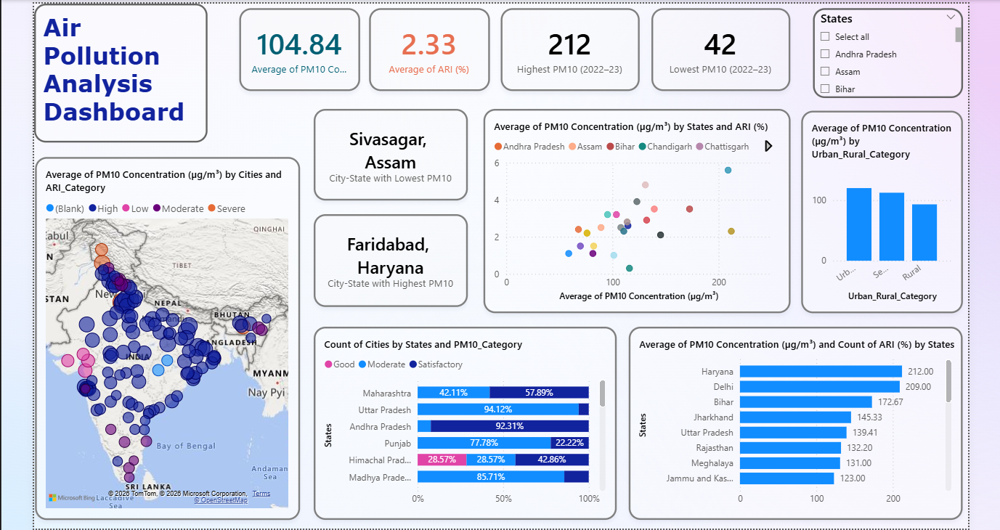
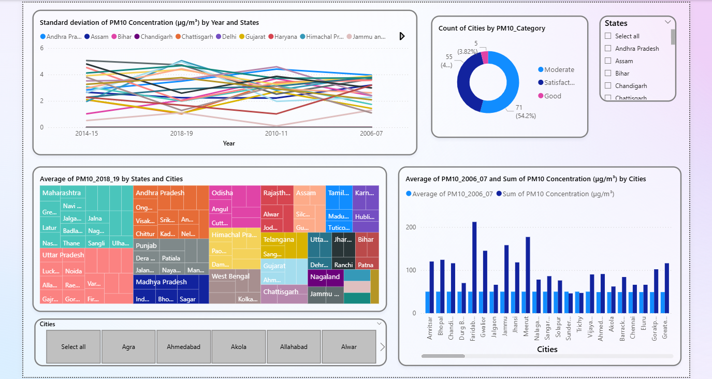

# 🌍 Air Quality Analysis Dashboard

An interactive Power BI dashboard that analyzes PM10 concentration and Air Quality Risk Index (ARI) across Indian cities and states. The dashboard enables users to explore pollution trends, compare regions, and identify areas with high and low pollution levels through interactive visualizations.

---

## Dashboard Preview

### Overview



### Trend Analysis



---

## Project Overview

Air pollution is a growing environmental concern affecting public health and quality of life. This project uses publicly available Government air quality data to visualize PM10 concentration and ARI statistics across different states and cities in India.

The dashboard provides decision-makers and analysts with an interactive way to monitor pollution levels, compare regions, and identify long-term trends.

---

## Objectives

- Analyze PM10 concentration across Indian cities.
- Compare pollution levels across states.
- Monitor pollution trends over multiple years.
- Identify cities with the highest and lowest pollution levels.
- Compare urban and rural pollution.
- Provide interactive filtering for better exploration.

---

## Dataset

- **Source:** Publicly available Government air quality data compiled from government reports/articles.
- **Geography:** India
- **Metrics:** PM10 Concentration, Air Quality Risk Index (ARI)
- **Granularity:** State-wise and City-wise

---

## Dashboard Features

- KPI Cards
  - Average PM10 Concentration
  - Average ARI
  - Highest PM10
  - Lowest PM10

- Geographic Analysis using Map Visuals

- State-wise Pollution Comparison

- City-wise Pollution Analysis

- Urban vs Rural Comparison

- PM10 Trend Analysis

- Pollution Category Distribution

- Interactive Filters
  - State
  - City

---

## Data Preparation

Power Query was used for data cleaning and transformation.

Transformations included:

- Removing blank rows
- Filtering records
- Trimming text
- Renaming columns
- Changing data types
- Replacing inconsistent values
- Splitting text using delimiters
- Removing unnecessary columns
- Creating derived tables for trend analysis

---

## Data Modeling

The dashboard uses a relational data model connecting PM10 and ARI datasets.

Additional supporting tables were created for:

- Trend Analysis
- Unpivoted data
- Time-series visualizations

---

## Visualizations Used

- KPI Cards
- Map
- Scatter Plot
- Clustered Bar Chart
- Stacked Bar Chart
- Treemap
- Donut Chart
- Line Chart
- Slicers

---

## Key Insights

- Pollution levels vary significantly across Indian states.
- Urban areas generally show higher PM10 concentration than rural regions.
- The dashboard highlights cities with the highest and lowest PM10 levels.
- Interactive filters allow exploration by state and city.
- Historical trend analysis enables comparison across multiple years.

---

## Tools & Technologies

- Power BI
- Power Query
- DAX
- Data Modeling
- Data Visualization

---

## Skills Demonstrated

- Data Cleaning
- Data Transformation
- Data Modeling
- Dashboard Design
- Business Intelligence
- KPI Reporting
- Interactive Reporting
- Analytical Storytelling

---

## Repository Structure

```
Air-Quality-Analysis-Dashboard/
│
├── Air_Quality_Analysis.pbix
├── README.md
└── images
    ├── overview.png
    ├── trends.png
```

---

## Future Improvements

- Include additional air quality indicators (PM2.5, NO₂, SO₂).
- Add forecasting for pollution trends.
- Integrate real-time pollution data.
- Enhance dashboard with drill-through pages.
